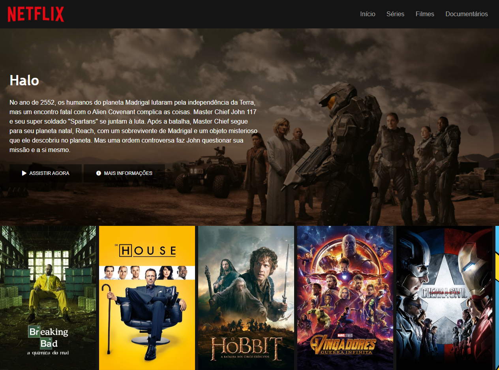

<h2 align="center">Recriando a Interface do Netflix</h2>

---

    

## 🚀 Tecnologias Utilizadas

O projeto foi desenvolvido utilizando as seguintes tecnologias

- HTML5
- CSS3
- JavaScript
- JQuery
